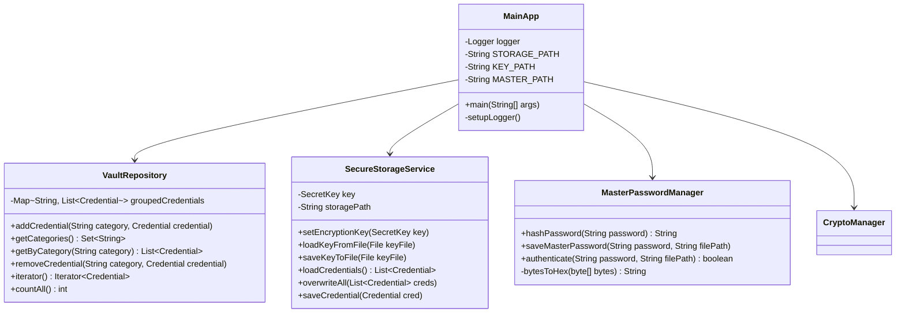

# SecurePassVault

Un sistema di gestione password sicuro implementato in Java che utilizza design pattern consolidati per garantire flessibilità, sicurezza e manutenibilità del codice.

## Indice

- [Panoramica](#panoramica)
- [Architettura](#architettura)
- [Design Patterns Implementati](#design-patterns-implementati)
- [Diagrammi di Sistema](#diagrammi-di-sistema)
- [Struttura del Progetto](#struttura-del-progetto)
- [Funzionalità](#funzionalità)
- [Installazione e Configurazione](#installazione-e-configurazione)
- [Utilizzo](#utilizzo)

## Panoramica

SecurePassVault è un'applicazione Java per la gestione sicura delle credenziali che implementa una architettura modulare basata su design pattern. Il sistema fornisce crittografia AES-256-GCM, organizzazione gerarchica delle credenziali tramite Composite Pattern, e strategie di crittografia intercambiabili attraverso Strategy Pattern.

### Caratteristiche Principali

- Crittografia AES-256-GCM per la protezione dei dati
- Gestione master password con hashing SHA-256
- Organizzazione gerarchica delle credenziali tramite Composite Pattern
- Sistema di notifiche real-time tramite Observer Pattern
- Ricerca avanzata con Stream API e operazioni funzionali
- Algoritmi di crittografia intercambiabili tramite Strategy Pattern
- Sistema di logging completo per audit
- Validazione e sanitizzazione degli input robusti
- Export asincrono in formato CSV
- Test suite completo con JUnit 5

## Architettura

### Diagramma Architetturale


Il sistema segue un'architettura a livelli che separa chiaramente le responsabilità tra presentazione, logica di business e accesso ai dati.

## Design Patterns Implementati

### Composite Pattern

Il Composite Pattern è utilizzato per creare una struttura ad albero delle credenziali, permettendo di trattare uniformemente oggetti singoli e composizioni di oggetti.


### Strategy Pattern

Il Strategy Pattern consente di definire una famiglia di algoritmi di crittografia e renderli intercambiabili a runtime.


### Factory Pattern

Il Factory Pattern è implementato per la creazione standardizzata di oggetti Credential.


## Diagrammi di Sistema

### Diagramma delle Classi Principali



### Flusso di Autenticazione


### Gestione delle Eccezioni


### Architettura di Sicurezza


## Struttura del Progetto

```
SecurePassVault/
├── src/main/java/com/securevault/
│   ├── composite/              # Implementazione Pattern Composite
│   │   ├── VaultComponent.java
│   │   ├── FolderComposite.java
│   │   └── CompositeIterator.java
│   ├── exception/              # Sistema di Gestione Eccezioni
│   │   ├── VaultException.java
│   │   ├── CryptoOperationException.java
│   │   ├── InputValidationException.java
│   │   ├── StorageAccessException.java
│   │   └── ExceptionHandler.java
│   ├── factory/                # Implementazione Pattern Factory
│   │   ├── AbstractCredentialFactory.java
│   │   ├── CredentialFactory.java
│   │   └── CredentialInterface.java
│   ├── model/                  # Modelli di Dominio
│   │   └── Credential.java
│   ├── repository/             # Livello di Accesso ai Dati
│   │   └── VaultRepository.java
│   ├── security/               # Sistema di Sicurezza
│   │   ├── EncryptionStrategy.java
│   │   ├── AesStrategy.java
│   │   ├── DummyStrategy.java
│   │   ├── CryptoManager.java
│   │   ├── MasterPasswordManager.java
│   │   └── CryptoException.java
│   ├── service/                # Servizi di Business Logic
│   │   └── SecureStorageService.java
│   ├── util/                   # Utilità e Supporto
│   │   ├── CSVExportTask.java
│   │   ├── InputSanitizer.java
│   │   ├── LogConfig.java
│   │   └── ReflectionUtil.java
│   └── MainApp.java           # Punto di Ingresso
├── src/main/resources/
│   └── config.properties       # File di Configurazione
├── pom.xml                     # Configurazione Maven
└── README.md
```

## Funzionalità

### Funzionalità Core
- **Gestione completa delle credenziali**: Creazione, modifica, eliminazione con validazione robusta degli input
- **Crittografia AES-256-GCM**: Protezione dei dati con generazione automatica di chiavi e IV
- **Sistema di autenticazione**: Master password con hash SHA-256 e protezione brute-force (5 tentativi)
- **Organizzazione gerarchica**: Struttura ad albero tramite cartelle con navigazione Composite Pattern
- **Export delle credenziali**: Formato CSV con crittografia delle password ed esecuzione asincrona
- **Sistema di notifiche**: Observer Pattern per monitoraggio eventi in tempo reale
- **Ricerca avanzata**: Stream API con filtri personalizzati e operazioni funzionali
- **Sistema di logging**: Audit trail completo per sicurezza e debugging

### Caratteristiche di Sicurezza
- Crittografia authenticated con AES-256-GCM
- Gestione sicura delle chiavi crittografiche
- Protezione master password con hash SHA-256
- Validazione e sanitizzazione input per prevenire injection
- Audit logging completo delle operazioni
- Auto-hiding delle password sensibili

## Installazione e Configurazione

### Prerequisiti
- Java Development Kit (JDK) 17 o versione superiore
- Apache Maven 3.6 o versione superiore

### Compilazione del Progetto
```bash
mvn clean compile
```

### Esecuzione
```bash
mvn exec:java -Dexec.mainClass="com.securevault.MainApp"
```

### Configurazione Strategia di Crittografia

Modificare il file `src/main/resources/config.properties`:

```properties
# Strategia di crittografia predefinita (produzione)
encryption.strategy=com.securevault.security.AesStrategy

# Strategia alternativa per testing (non sicura per produzione)
# encryption.strategy=com.securevault.security.DummyStrategy
```

## Utilizzo

### Primo Avvio
1. Al primo avvio, il sistema richiederà l'impostazione di una master password
2. Verrà generata automaticamente una chiave crittografica sicura
3. I file di configurazione verranno creati automaticamente

### File Generati dal Sistema
- `master.hash`: Hash SHA-256 della master password
- `vault.key`: Chiave crittografica serializzata (Java ObjectOutputStream)
- `vault.enc`: Database delle credenziali crittografate (formato CSV interno)
- `vault.log`: Log delle operazioni applicative
- `securevault.log`: Log dettagliato del sistema con timestamp

### Operazioni Principali

#### 1. Gestione Credenziali
- **Aggiunta**: Input sanitizzato per servizio e username, password preservata per caratteri speciali
- **Modifica**: Selezione sicura con validazione indice, aggiornamento in-place
- **Rimozione**: Validazione indice con cleanup automatico delle categorie vuote
- **Organizzazione**: Categorizzazione automatica in cartelle Social/Work tramite Composite Pattern

#### 2. Ricerca e Visualizzazione Avanzata
- **Ricerca per servizio**: Implementazione con Stream API e filtri case-insensitive
- **Visualizzazione password**: Display temporizzato (5 secondi) con auto-clear console
- **Navigazione struttura**: Visualizzazione ad albero delle credenziali organizzate

#### 3. Export e Backup
- **Export CSV asincrono**: Esecuzione in thread separato con password crittografate
- **Formato output**: `Service,Username,EncryptedPassword`
- **Notifica completamento**: Feedback utente al termine dell'operazione

#### 4. Sistema di Notifiche
- **Observer Pattern**: Monitoraggio real-time degli eventi vault
- **Notifiche eventi**: Aggiunta, rimozione, modifica credenziali
- **Statistiche sessione**: Contatore eventi e riepilogo attività

#### 5. Sicurezza e Amministrazione
- **Autenticazione**: Master password con limite 5 tentativi e hash SHA-256
- **Cambio password**: Validazione password corrente e requisiti lunghezza minima
- **Logging audit**: Tracciamento completo delle operazioni per sicurezza

### Estensibilità

Il sistema è progettato per essere facilmente estensibile. Per aggiungere nuove strategie di crittografia:

1. Implementare l'interfaccia `EncryptionStrategy`
2. Aggiungere la classe al classpath
3. Configurare la nuova strategia in `config.properties`
4. Il sistema caricherà automaticamente la strategia tramite reflection

### Esempio Implementazione Strategia Personalizzata

```java
public class CustomEncryptionStrategy implements EncryptionStrategy {
    
    @Override
    public String encrypt(String plaintext) throws CryptoException {
        // Implementazione algoritmo di crittografia personalizzato
        return encryptedText;
    }
    
    @Override 
    public String decrypt(String ciphertext) throws CryptoException {
        // Implementazione algoritmo di decrittografia personalizzato
        return decryptedText;
    }
}
```

## Considerazioni sulla Sicurezza

- Le password vengono crittografate utilizzando AES-256-GCM con IV casuali
- La master password non viene mai memorizzata in chiaro
- I log non contengono informazioni sensibili
- I file di chiavi sono protetti dal file system del sistema operativo
- L'input utente viene sanitizzato per prevenire attacchi di injection

## Licenza

Questo progetto è sviluppato per scopi educativi nell'ambito del corso di Programmazione Orientata agli Oggetti in Java.
